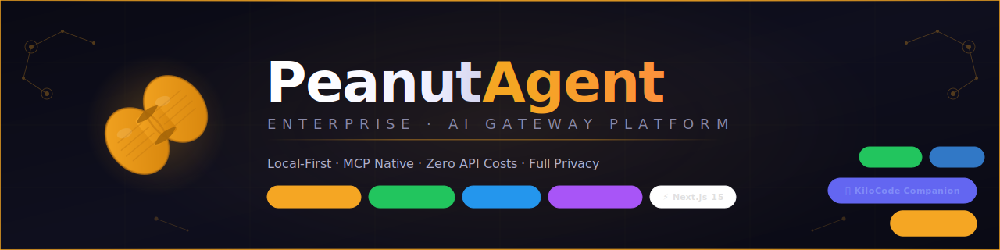

<div align="center">

<!-- Banner -->


<br/>

<!-- Logo -->


<br/><br/>

<!-- Icon -->


<br/>

### Plataforma de Gateway de IA · Local-First · MCP Nativo · Grado Empresarial

<br/>

[](CHANGELOG.md)
[](https://www.typescriptlang.org/)
[](https://nextjs.org/)
[](https://fastify.dev/)
[](https://python.org/)

[](https://modelcontextprotocol.io/)
[](https://ollama.ai/)
[](https://docker.com/)
[](LICENSE)

[](services/gateway/tests/)
[](https://pnpm.io/)
[](https://nodejs.org/)
[](https://sqlite.org/)

<br/>

> **El compañero perfecto para KiloCode** — Un Gateway de IA listo para producción con servidor MCP nativo,
> inferencia local con Ollama, gestión de Docker y seguridad de grado empresarial.
> **Cero costos de API. Privacidad total. Corre completamente en tu máquina.**

<br/>

[🚀 Inicio Rápido](#-inicio-rápido) · [🔌 Integración KiloCode](#-integración-kilocode) · [📖 Docs](docs/) · [🏗️ Arquitectura](#️-arquitectura) · [🔒 Seguridad](#-arquitectura-de-seguridad)

<br/>

📖 [Read in English](README.md) · 🌐 [GitHub Pages](https://your-org.github.io/peanut-agent)

</div>

---

## ✨ ¿Qué es PeanutAgent?

**PeanutAgent Enterprise** es una plataforma full-stack de gestión de agentes de IA que actúa como un gateway seguro e inteligente entre tus herramientas de desarrollo y los modelos de IA. Conecta los LLMs locales con herramientas de nivel empresarial.

<table>
<tr>
<td width="50%">

### 🔌 Servidor MCP (v2.0.0)
KiloCode descubre y usa tus modelos Ollama locales como **herramientas nativas** vía el Model Context Protocol. 7 herramientas, 4 recursos, 2 prompts — totalmente compatible con la especificación.

### 🤖 Backend de IA Local
Usa PeanutAgent como **backend de IA gratuito y privado** para KiloCode. Sin costos de API, sin datos saliendo de tu máquina. Compatible con qwen2.5, llama3.2, codellama y cualquier modelo Ollama.

### 🐳 Gestión de Docker
Gestiona contenedores **directamente desde KiloCode** vía herramientas MCP. Lista, inicia, detiene, inspecciona y transmite logs — todo desde tu IDE.

</td>
<td width="50%">

### 🔒 Seguridad Empresarial
Cookies JWT httpOnly · TOTP 2FA (RFC 6238) · hash de contraseñas scrypt · secretos cifrados AES-256-GCM · cadena de auditoría inmutable SHA-256.

### 📊 Dashboard Administrativo
Dashboard Next.js 15 con métricas en tiempo real, gestión de agentes, control Docker, terminal WebSocket y una página dedicada de integración KiloCode MCP.

### ⚖️ Balanceo de Carga Inteligente
El Orquestador OpenClaw implementa **Smooth Weighted Round-Robin** (algoritmo Nginx) entre agentes con enrutamiento basado en salud y métricas por agente.

</td>
</tr>
</table>

---

## 🏗️ Arquitectura

```
╔══════════════════════════════════════════════════════════════════════════╗
║                    PeanutAgent Enterprise v2.0.0                         ║
╠═══════════════════════════╦══════════════════════════════════════════════╣
║   Dashboard Next.js 15    ║         Gateway API Fastify                  ║
║   (Puerto 3000)           ║         (Puerto 3001)                        ║
║   ─────────────────────   ║   ──────────────────────────────             ║
║   • Auth (2FA TOTP)       ║   • Orquestador OpenClaw (SWRR)              ║
║   • Gestión de Agentes    ║   • Auth JWT (cookies httpOnly)              ║
║   • Gestión de Docker     ║   • Verificación TOTP 2FA                    ║
║   • Visor de Auditoría    ║   • Cadena de Auditoría Inmutable (SHA-256)  ║
║   • Terminal WebSocket    ║   • Rate Limiting Adaptativo                 ║
║   • Página KiloCode MCP   ║   • API de Gestión Docker                    ║
║   • Configuración         ║   • Puente Kilo Code (AES-256-GCM)           ║
║                           ║   • Servidor MCP (7 tools, 4 resources)      ║
║                           ║   • Monitoreo de Salud (cada 30s)            ║
║                           ║   • Terminal WebSocket                       ║
╠═══════════════════════════╩══════════════════════════════════════════════╣
║                      Datos e Infraestructura                              ║
║   SQLite (modo WAL) │ Ollama LLM │ Docker Socket │ OpenTelemetry         ║
╚══════════════════════════════════════════════════════════════════════════╝
                              ↕ Protocolo MCP (2024-11-05)
╔══════════════════════════════════════════════════════════════════════════╗
║                         KiloCode IDE                                      ║
║   peanut_dispatch_agent · peanut_docker_* · peanut_list_agents           ║
╚══════════════════════════════════════════════════════════════════════════╝
```

### Diseño Orientado al Dominio (DDD)

El gateway sigue principios estrictos de **DDD** con cuatro capas:

| Capa | Ruta | Responsabilidad |
|------|------|-----------------|
| **Dominio** | [`src/domain/`](services/gateway/src/domain/) | Entidades de negocio puras (Agent, User, AuditEntry) con invariantes |
| **Aplicación** | [`src/application/`](services/gateway/src/application/) | Casos de uso y servicios (AuthService, OpenClawService, DockerService) |
| **Infraestructura** | [`src/infrastructure/`](services/gateway/src/infrastructure/) | Repositorios SQLite, cliente Kilo, **Servidor MCP** |
| **Interfaz** | [`src/interfaces/`](services/gateway/src/interfaces/) | Rutas HTTP Fastify, handler WebSocket terminal |

---

## 🚀 Inicio Rápido

### Requisitos Previos

| Requisito | Versión | Notas |
|-----------|---------|-------|
| [Node.js](https://nodejs.org/) | `≥ 20.0.0` | LTS recomendado |
| [pnpm](https://pnpm.io/) | `≥ 9.0.0` | `npm i -g pnpm` |
| [Docker](https://docker.com/) | Cualquiera | Opcional, para gestión de contenedores |
| [Python](https://python.org/) | `≥ 3.10` | Opcional, para el agente Python |
| [Ollama](https://ollama.ai/) | Último | Para inferencia LLM local |

### Configuración de Desarrollo

```bash
# 1. Clonar el repositorio
git clone https://github.com/your-org/peanut-agent.git
cd peanut-agent

# 2. Instalar todas las dependencias (monorepo)
pnpm install

# 3. Compilar el paquete de tipos compartidos
pnpm --filter @peanut/shared-types build

# 4. Configurar el entorno
cp services/gateway/.env.example services/gateway/.env

# Generar secretos (requerido)
echo "JWT_SECRET=$(openssl rand -hex 32)"
echo "KILO_ENCRYPTION_KEY=$(openssl rand -hex 32)"
# → Pegar estos valores en services/gateway/.env

# 5. Iniciar el Gateway API (puerto 3001)
pnpm --filter @peanut/gateway dev

# 6. Iniciar el Dashboard (puerto 3000) — en una nueva terminal
pnpm --filter @peanut/dashboard dev
```

Abre **http://localhost:3000** e inicia sesión con:
- **Email:** `admin@peanut.local`
- **Contraseña:** `PeanutAdmin@2024!`

### Producción (Docker Compose)

```bash
# 1. Configurar secretos
cp .env.example .env
# Editar .env: establecer JWT_SECRET y KILO_ENCRYPTION_KEY

# 2. Lanzar todos los servicios
docker compose up -d

# Servicios:
#   Dashboard:    http://localhost:3000
#   Gateway:      http://localhost:3001
#   Servidor MCP: http://localhost:3001/mcp
#   Ollama:       http://localhost:11434
```

### Instalar Modelos Ollama

```bash
ollama pull qwen2.5:7b       # Recomendado para tareas de código
ollama pull llama3.2:3b      # Ligero, respuestas rápidas
ollama pull codellama:7b     # Modelo especializado en código
ollama pull nomic-embed-text # Para embeddings de memoria RAG
```

---

## 🔌 Integración KiloCode

> **Conecta KiloCode a PeanutAgent en menos de 30 segundos.**

PeanutAgent v2.0.0 incluye un **Servidor MCP (Model Context Protocol)** completo que KiloCode descubre de forma nativa. Esto te da inferencia de IA gratuita y privada directamente en tu IDE.

### Paso 1 — Agregar Servidor MCP a KiloCode

**Opción A: Vía UI de KiloCode**
1. Abre KiloCode en VS Code
2. Haz clic en el ícono MCP en la barra lateral
3. **Agregar Servidor** → Ingresa URL: `http://localhost:3001/mcp`

**Opción B: Editar configuración directamente**

Edita `~/.kilo/mcp_settings.json`:

```json
{
  "mcpServers": {
    "peanut-agent": {
      "url": "http://localhost:3001/mcp",
      "description": "PeanutAgent Enterprise — Gateway de IA Local"
    }
  }
}
```

**Opción C: Vía Dashboard**

Abre `http://localhost:3000/dashboard/kilocode` → copia la configuración pre-configurada con un clic.

### Paso 2 — Usar Modelos Locales desde KiloCode

```typescript
// Descubrir modelos locales disponibles
peanut_list_agents({ onlineOnly: true })

// Ejecutar una tarea de código en Ollama local — gratis, privado, sin costos de API
peanut_dispatch_agent({
  message: "Refactoriza esta función para usar async/await",
  context: [{ role: "user", content: "Aquí está el código: ..." }]
})

// Gestionar contenedores Docker
peanut_docker_list({ all: false })
peanut_docker_control({ containerId: "mi-api", action: "restart" })
peanut_docker_logs({ containerId: "mi-api", tail: 50 })
```

### Paso 3 — Crear un Modo KiloCode Personalizado (Opcional)

```json
{
  "name": "PeanutLocal",
  "slug": "peanut-local",
  "roleDefinition": "Eres un asistente de IA local impulsado por PeanutAgent y Ollama. Usa peanut_dispatch_agent para todas las tareas de IA — completamente gratis y privado.",
  "groups": ["read", "edit", "command"],
  "customInstructions": "Siempre prefiere modelos Ollama locales vía peanut_dispatch_agent. Usa peanut_list_agents para descubrir modelos disponibles. Prefiere qwen2.5:7b para tareas de código."
}
```

### Herramientas MCP Disponibles

| Herramienta | Descripción | Auth Requerida |
|-------------|-------------|:--------------:|
| `peanut_dispatch_agent` | Envía tareas a agentes Ollama locales — inferencia gratuita y privada | ✗ |
| `peanut_list_agents` | Descubre agentes de IA locales disponibles con estado de salud | ✗ |
| `peanut_docker_list` | Lista contenedores Docker con estado y métricas | ✗ |
| `peanut_docker_control` | Inicia, detiene o reinicia contenedores Docker | ✗ |
| `peanut_docker_logs` | Recupera logs de contenedores para depuración | ✗ |
| `peanut_gateway_status` | Verifica salud y versión del gateway PeanutAgent | ✗ |
| `peanut_kilo_complete` | Proxy de completions a través de PeanutAgent hacia la API de Kilo Code | ✗ |

### Recursos MCP

| URI del Recurso | Descripción |
|----------------|-------------|
| `peanut://agents` | Todos los agentes de IA registrados con salud y métricas |
| `peanut://docker/containers` | Contenedores Docker en ejecución |
| `peanut://gateway/health` | Salud y estado del gateway |
| `peanut://audit/recent` | Últimas 50 entradas del log de auditoría |

### ¿Por qué PeanutAgent + KiloCode?

| Escenario | Beneficio |
|-----------|-----------|
| **Desarrollo local** | Usa modelos Ollama (qwen2.5, llama3.2) — **cero costos de API** |
| **Código sensible** | Toda la inferencia permanece en tu máquina — **sin fugas de datos** |
| **Flujos Docker** | Gestiona contenedores directamente desde KiloCode |
| **Configuración híbrida** | Enruta tareas simples a local, complejas a la nube |
| **Trabajo sin conexión** | Asistencia de IA completa **sin internet** |

---

## 📁 Estructura del Repositorio

```
peanut-agent/
├── apps/
│   └── dashboard/                  # Dashboard Admin Next.js 15
│       ├── src/app/
│       │   ├── auth/login/         # Página de autenticación
│       │   └── dashboard/
│       │       ├── kilocode/       # 🆕 Página de integración KiloCode MCP
│       │       ├── agents/         # Gestión de agentes
│       │       ├── docker/         # Gestión de Docker
│       │       ├── audit/          # Visor de log de auditoría inmutable
│       │       ├── terminal/       # Terminal WebSocket
│       │       └── settings/       # Configuración de la plataforma
│       ├── src/components/         # Componentes UI reutilizables (Radix UI)
│       └── src/lib/                # Cliente API, utilidades de auth
│
├── services/
│   └── gateway/                    # Gateway API Fastify (TypeScript, DDD)
│       ├── src/domain/             # Entidades de negocio (Agent, User, AuditEntry)
│       ├── src/application/        # Servicios (Auth, OpenClaw, Docker, Crypto)
│       ├── src/infrastructure/     # Repos SQLite, cliente Kilo, servidor MCP
│       └── src/interfaces/         # Rutas HTTP, handler WebSocket
│
├── packages/
│   └── shared-types/               # Interfaces TypeScript compartidas (incl. tipos MCP)
│
├── docs/                           # Documentación
│   ├── ARCHITECTURE.md
│   ├── KILOCODE_INTEGRATION.md
│   ├── REFLECTION_MEMORY.md
│   ├── SECURITY.md
│   ├── TROUBLESHOOTING.md
│   └── WIZARD.md
│
├── agent.py                        # Núcleo del agente Python (LLM local)
├── tools.py                        # Ejecutor de herramientas seguro (allowlist)
├── memory.py                       # Sistema de memoria RAG (JSONL + embeddings)
├── reflection.py                   # Bucle de reflexión (auto-corrección)
├── gateway.py                      # Gateway de consola (multi-sesión)
├── web_ui.py                       # Gateway web (FastAPI + WebSocket)
├── docker-compose.yml              # Despliegue en producción
└── .github/workflows/              # Pipelines CI/CD
```

---

## 🔒 Arquitectura de Seguridad

### Stack de Autenticación

```
┌─────────────────────────────────────────────────────┐
│  Flujo de Login                                      │
│  ─────────────────────────────────────────────────  │
│  1. POST /auth/login → verificar scrypt → emitir JWT│
│  2. POST /auth/totp/verify → verificar TOTP → sesión│
│  3. Cookie httpOnly + Secure + SameSite=Strict       │
│  4. Expiración de sesión 8h, revocable en SQLite     │
└─────────────────────────────────────────────────────┘
```

| Característica | Implementación |
|----------------|----------------|
| **Sesiones JWT** | Cookies httpOnly, Secure, SameSite=Strict · expiración 8h |
| **TOTP 2FA** | RFC 6238 vía `otplib` · 10 códigos de respaldo de un solo uso |
| **Hash de Contraseñas** | scrypt (N=2¹⁴, r=8, p=1) · salida 64 bytes · sal aleatoria 32 bytes |
| **Cifrado de Secretos** | AES-256-GCM · claves en env, nunca en BD |
| **Cabeceras de Seguridad** | `@fastify/helmet` · HSTS, CSP, X-Frame-Options |

### Cadena de Auditoría Inmutable

Cada acción se registra en una **cadena de huellas criptográficas**:

```
Entrada N:   SHA-256(huellaAnterior + contenido) → huella
Entrada N+1: SHA-256(huella_N + contenido) → huella
```

Cualquier modificación a cualquier entrada **rompe la cadena** — la detección de manipulación es automática.

### Rate Limiting Adaptativo

| Ámbito | Límite | Backoff |
|--------|--------|---------|
| Login (por IP) | 10 req/min | Exponencial hasta 5 min |
| TOTP (por usuario) | 5 intentos/min | Exponencial hasta 10 min |
| Dispatch API (por usuario) | 60 req/min | Estándar |

---

## ⚙️ Orquestador OpenClaw

El servicio OpenClaw implementa **Smooth Weighted Round-Robin** (algoritmo Nginx) para balanceo de carga inteligente:

```
Agentes: [{nombre: A, peso: 5}, {nombre: B, peso: 3}, {nombre: C, peso: 2}]

Cada solicitud:
  1. Incrementar pesoActual por agente.peso para todos los agentes
  2. Seleccionar agente con mayor pesoActual
  3. Restar pesoTotal del pesoActual del agente seleccionado

Resultado: ~50% → A, ~30% → B, ~20% → C (proporcional a los pesos)
```

**Características:**
- Registro/desregistro dinámico de agentes en tiempo de ejecución
- Enrutamiento basado en salud — agentes no saludables excluidos automáticamente
- Métricas por agente: latencia, tasa de éxito, uso de tokens
- Verificaciones de salud en segundo plano cada **30 segundos**

---

## 📡 Referencia de API

<details>
<summary><strong>Autenticación</strong></summary>

```
POST /api/v1/auth/login              Login (email + contraseña)
POST /api/v1/auth/totp/verify        Completar verificación TOTP 2FA
POST /api/v1/auth/logout             Invalidar sesión
GET  /api/v1/auth/me                 Obtener perfil del usuario actual
POST /api/v1/auth/totp/setup         Habilitar 2FA (devuelve código QR)
POST /api/v1/auth/password           Cambiar contraseña
```
</details>

<details>
<summary><strong>Gestión de Agentes</strong></summary>

```
GET    /api/v1/agents                Listar todos los agentes con estado de salud
POST   /api/v1/agents                Registrar nuevo agente
PUT    /api/v1/agents/:id            Actualizar configuración del agente
DELETE /api/v1/agents/:id            Eliminar agente
GET    /api/v1/agents/:id/health     Forzar verificación de salud
POST   /api/v1/openclaw/dispatch     Enviar solicitud (balanceo automático)
```
</details>

<details>
<summary><strong>Gestión de Docker</strong></summary>

```
GET    /api/v1/docker/containers              Listar contenedores
POST   /api/v1/docker/containers              Desplegar nuevo contenedor
POST   /api/v1/docker/containers/:id/start   Iniciar contenedor
POST   /api/v1/docker/containers/:id/stop    Detener contenedor
DELETE /api/v1/docker/containers/:id         Eliminar contenedor
GET    /api/v1/docker/containers/:id/metrics Métricas en tiempo real
GET    /api/v1/docker/containers/:id/logs    Logs del contenedor
GET    /api/v1/docker/images                 Listar imágenes locales
```
</details>

<details>
<summary><strong>Puente Kilo Code</strong></summary>

```
GET  /api/v1/kilo/status     Estado de conexión + estadísticas de uso
GET  /api/v1/kilo/config     Configuración (solo admin)
PUT  /api/v1/kilo/config     Actualizar config + clave API (cifrada AES-256)
POST /api/v1/kilo/complete   Proxy de solicitud de completion a Kilo Code API
GET  /api/v1/kilo/usage      Estadísticas de uso de tokens
```
</details>

<details>
<summary><strong>Servidor MCP (v2.0.0)</strong></summary>

```
GET  /mcp                    Descubrimiento del servidor MCP (capacidades, herramientas)
POST /mcp                    Endpoint JSON-RPC 2.0 (todos los métodos MCP)
GET  /mcp/events             Endpoint SSE para actualizaciones en tiempo real
```

**Métodos JSON-RPC soportados:** `initialize`, `tools/list`, `tools/call`, `resources/list`, `resources/read`, `prompts/list`, `prompts/get`, `ping`
</details>

<details>
<summary><strong>Terminal WebSocket</strong></summary>

```
ws://localhost:3001/ws/terminal    Terminal en tiempo real autenticado
```
</details>

---

## 🧪 Testing

```bash
# Ejecutar todos los tests (monorepo)
pnpm test

# Tests unitarios del gateway
pnpm --filter @peanut/gateway test

# Gateway con reporte de cobertura
pnpm --filter @peanut/gateway test:coverage

# Ejecutar archivo de test específico (ej. servidor MCP)
cd services/gateway && pnpm vitest run tests/unit/mcp.server.test.ts

# Tests del dashboard
pnpm --filter @peanut/dashboard test

# Tests del agente Python
pytest tests/ -v

# Python con cobertura
pytest tests/ -v --cov=. --cov-report=html
```

**Requisitos de cobertura:** `80%` líneas · funciones · ramas · sentencias

---

## 🌍 Variables de Entorno

### Gateway (`services/gateway/.env`)

| Variable | Requerida | Por Defecto | Descripción |
|----------|:---------:|-------------|-------------|
| `JWT_SECRET` | ✅ | — | Secreto de firma JWT (mín. 32 chars) |
| `KILO_ENCRYPTION_KEY` | ✅ | — | Clave AES-256 para secretos (64 chars hex) |
| `PORT` | ✗ | `3001` | Puerto HTTP del gateway |
| `CORS_ORIGIN` | ✗ | `http://localhost:3000` | Orígenes CORS permitidos |
| `DATA_DIR` | ✗ | `./data` | Directorio de base de datos SQLite |
| `LOG_LEVEL` | ✗ | `info` | Nivel de log Pino |
| `DEFAULT_ADMIN_PASSWORD` | ✗ | — | Sobreescribir contraseña inicial del admin |

### Dashboard (`apps/dashboard/.env.local`)

| Variable | Requerida | Por Defecto | Descripción |
|----------|:---------:|-------------|-------------|
| `NEXT_PUBLIC_API_URL` | ✗ | `http://localhost:3001` | URL HTTP del gateway |
| `NEXT_PUBLIC_WS_URL` | ✗ | `ws://localhost:3001` | URL WebSocket del gateway |
| `GATEWAY_URL` | ✗ | — | URL interna del gateway para rewrites de Next.js |

---

## 🐍 Agente Python (Legacy)

El agente Python original corre de forma independiente y provee una interfaz de IA local ligera:

```bash
# Asistente de configuración interactivo
python wizard.py

# Gateway de consola (multi-sesión, UI Rich)
python gateway.py

# Gateway web (FastAPI + WebSocket)
python web_ui.py
# Abrir: http://127.0.0.1:18889/
```

**Características del agente Python:**
- 🔄 **Bucle de Reflexión** — Auto-corrección con validación de esquema Pydantic (hasta 3 reintentos)
- 🧠 **Memoria RAG** — Almacén JSONL append-only con embeddings Ollama + similitud coseno
- 🛡️ **Seguridad Allowlist** — Comandos shell restringidos a operaciones seguras de lectura/diagnóstico
- 🎮 **Gamificación** — Sistema de contador de maníes (`~/.peanut-agent/state.json`)

---

## 📦 Stack Tecnológico

<table>
<tr>
<th>Capa</th>
<th>Tecnología</th>
<th>Versión</th>
<th>Propósito</th>
</tr>
<tr>
<td rowspan="6"><strong>Backend</strong></td>
<td>Fastify</td>
<td>4.x</td>
<td>Servidor HTTP de alto rendimiento</td>
</tr>
<tr>
<td>TypeScript</td>
<td>5.7</td>
<td>Seguridad de tipos en todo el stack</td>
</tr>
<tr>
<td>better-sqlite3</td>
<td>11.x</td>
<td>Base de datos embebida (modo WAL)</td>
</tr>
<tr>
<td>@fastify/jwt</td>
<td>8.x</td>
<td>Autenticación JWT</td>
</tr>
<tr>
<td>otplib</td>
<td>12.x</td>
<td>TOTP 2FA (RFC 6238)</td>
</tr>
<tr>
<td>Zod</td>
<td>3.x</td>
<td>Validación de esquemas en tiempo de ejecución</td>
</tr>
<tr>
<td rowspan="5"><strong>Frontend</strong></td>
<td>Next.js</td>
<td>15.1</td>
<td>Framework React (App Router)</td>
</tr>
<tr>
<td>React</td>
<td>19.x</td>
<td>Biblioteca UI</td>
</tr>
<tr>
<td>Radix UI</td>
<td>Último</td>
<td>Primitivas de componentes accesibles</td>
</tr>
<tr>
<td>Tailwind CSS</td>
<td>3.x</td>
<td>Estilos utility-first</td>
</tr>
<tr>
<td>Recharts</td>
<td>2.x</td>
<td>Gráficos de métricas en tiempo real</td>
</tr>
<tr>
<td rowspan="3"><strong>IA/ML</strong></td>
<td>Ollama</td>
<td>Último</td>
<td>Inferencia LLM local</td>
</tr>
<tr>
<td>Protocolo MCP</td>
<td>2024-11-05</td>
<td>Integración de herramientas KiloCode</td>
</tr>
<tr>
<td>OpenTelemetry</td>
<td>1.x</td>
<td>Trazado distribuido</td>
</tr>
<tr>
<td rowspan="3"><strong>Testing</strong></td>
<td>Vitest</td>
<td>3.x</td>
<td>Tests unitarios/integración TypeScript</td>
</tr>
<tr>
<td>pytest</td>
<td>Último</td>
<td>Tests del agente Python</td>
</tr>
<tr>
<td>@testing-library/react</td>
<td>16.x</td>
<td>Tests de componentes del dashboard</td>
</tr>
</table>

---

## 🤝 Contribuir

¡Las contribuciones son bienvenidas! Lee [CONTRIBUTING.md](CONTRIBUTING.md) para:
- Flujo de trabajo de desarrollo y estrategia de ramas
- Guías de estilo de código (ESLint + modo estricto TypeScript)
- Requisitos de tests (umbral de cobertura 80%)
- Proceso de revisión de PRs

---

## 📄 Licencia

**MIT** — ver [LICENSE](LICENSE) para detalles.

---

<div align="center">

**Construido con ❤️ para la comunidad KiloCode**

[⭐ Star en GitHub](https://github.com/your-org/peanut-agent) · [🐛 Reportar Bug](https://github.com/your-org/peanut-agent/issues) · [💡 Solicitar Feature](https://github.com/your-org/peanut-agent/issues)

<sub>PeanutAgent Enterprise v2.0.0 · Licencia MIT · IA Local-First</sub>

</div>
