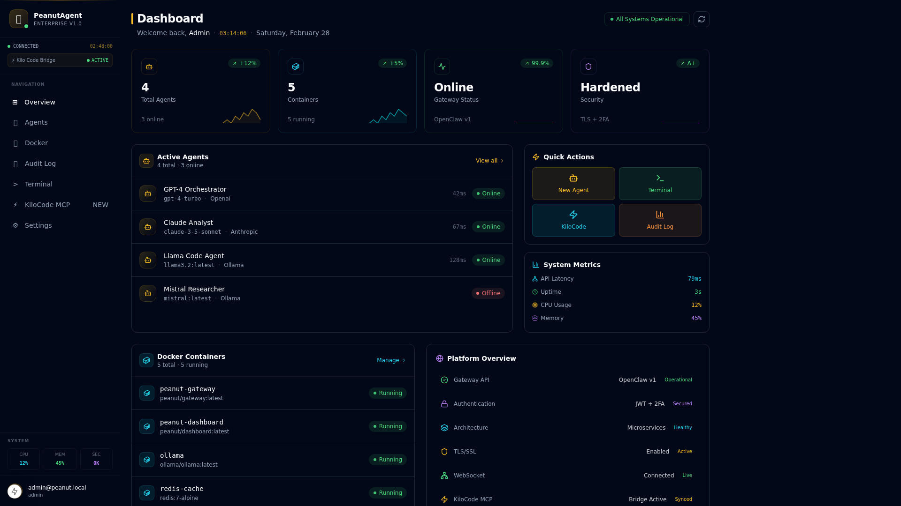
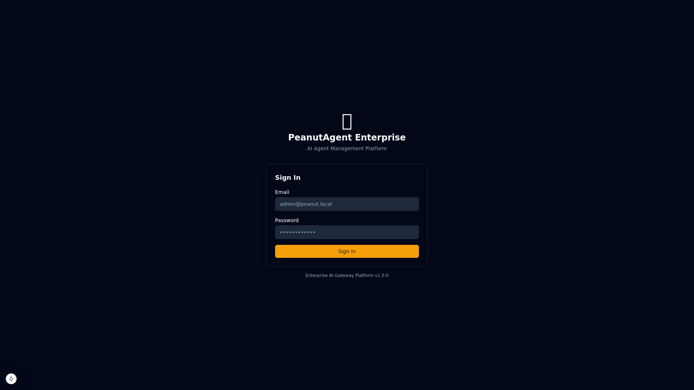
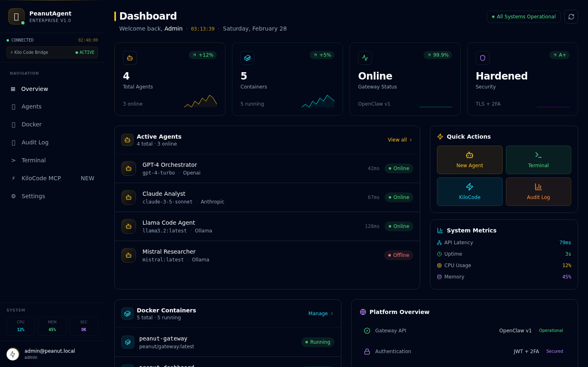

<div align="center">

<!-- Banner -->


<br/>

<!-- Logo -->


<br/><br/>

<!-- Icon -->


<br/>

[](CHANGELOG.md)
[](https://www.typescriptlang.org/)
[](https://nextjs.org/)
[](https://fastify.dev/)
[](https://python.org/)

[](https://modelcontextprotocol.io/)
[](https://ollama.ai/)
[](https://docker.com/)
[](LICENSE)

[](services/gateway/tests/)
[](https://pnpm.io/)
[](https://nodejs.org/)
[](https://sqlite.org/)

<br/>

> **The perfect companion for KiloCode** — A production-ready AI Gateway with native MCP Server,
> Ollama local inference, Docker management, and enterprise-grade security.
> **Zero API costs. Full privacy. Runs entirely on your machine.**

<br/>

[🚀 Quick Start](#-quick-start) · [🔌 KiloCode Integration](#-kilocode-integration) · [📖 Docs](docs/) · [🏗️ Architecture](#️-architecture) · [🔒 Security](#-security-architecture)

<br/>

🇪🇸 [Leer en Español](README.es.md) · 🌐 [GitHub Pages](https://your-org.github.io/peanut-agent)

</div>

---

## ✨ What is PeanutAgent?

**PeanutAgent Enterprise** is a full-stack AI Agent Management Platform that acts as a secure, intelligent gateway between your development tools and AI models. It bridges the gap between local LLMs and enterprise-grade tooling.

<table>
<tr>
<td width="50%">

### 🔌 MCP Server (v2.0.0)
KiloCode discovers and uses your local Ollama models as **native tools** via the Model Context Protocol. 7 tools, 4 resources, 2 prompts — all spec-compliant.

### 🤖 Local AI Backend
Use PeanutAgent as a **free, private AI backend** for KiloCode. No API costs, no data leaving your machine. Supports qwen2.5, llama3.2, codellama, and any Ollama model.

### 🐳 Docker Management
Manage containers **directly from KiloCode** via MCP tools. List, start, stop, inspect, and stream logs — all from your IDE.

</td>
<td width="50%">

### 🔒 Enterprise Security
JWT httpOnly cookies · TOTP 2FA (RFC 6238) · scrypt password hashing · AES-256-GCM encrypted secrets · Immutable SHA-256 audit chain.

### 📊 Admin Dashboard
Next.js 15 dashboard with real-time metrics, agent management, Docker control, WebSocket terminal, and a dedicated KiloCode MCP integration page.

### ⚖️ Smart Load Balancing
OpenClaw Orchestrator implements **Smooth Weighted Round-Robin** (Nginx algorithm) across agents with health-based routing and per-agent metrics.

</td>
</tr>
</table>

---

## 📸 Dashboard Screenshots

> **New Enterprise Dashboard** — Redesigned with glassmorphism, neon effects, animated metrics, and a cyberpunk-inspired dark theme.

<div align="center">

### 🖥️ Main Dashboard


<br/>

### 🔐 Login Page


<br/>

### 📊 Dashboard Overview (1440px)


</div>

**Dashboard Features:**
- 🌑 **Dark glassmorphism** design with backdrop blur effects
- ✨ **Animated stat cards** with sparkline charts and live counters
- 🟢 **Real-time status indicators** with neon glow effects
- 📈 **System metrics** with animated progress bars
- ⚡ **Quick actions** panel for instant navigation
- 🔒 **Platform overview** with security status
- 🤖 **Agent list** with health monitoring and latency display
- 🐳 **Docker containers** panel with live status
- 🎨 **Cyber grid background** with ambient glow effects

---

## 🏗️ Architecture

```
╔══════════════════════════════════════════════════════════════════════════╗
║                    PeanutAgent Enterprise v2.0.0                         ║
╠═══════════════════════════╦══════════════════════════════════════════════╣
║   Next.js 15 Dashboard    ║         Fastify API Gateway                  ║
║   (Port 3000)             ║         (Port 3001)                          ║
║   ─────────────────────   ║   ──────────────────────────────             ║
║   • Auth (2FA TOTP)       ║   • OpenClaw Orchestrator (SWRR)             ║
║   • Agent Management      ║   • JWT Auth (httpOnly cookies)              ║
║   • Docker Management     ║   • TOTP 2FA Verification                    ║
║   • Audit Log Viewer      ║   • Immutable Audit Chain (SHA-256)          ║
║   • WebSocket Terminal    ║   • Adaptive Rate Limiting                   ║
║   • KiloCode MCP Page     ║   • Docker Management API                    ║
║   • Settings              ║   • Kilo Code Bridge (AES-256-GCM)           ║
║                           ║   • MCP Server (7 tools, 4 resources)        ║
║                           ║   • Health Monitoring (30s intervals)        ║
║                           ║   • WebSocket Terminal                       ║
╠═══════════════════════════╩══════════════════════════════════════════════╣
║                      Data & Infrastructure                                ║
║   SQLite (WAL mode) │ Ollama LLM │ Docker Socket │ OpenTelemetry         ║
╚══════════════════════════════════════════════════════════════════════════╝
                              ↕ MCP Protocol (2024-11-05)
╔══════════════════════════════════════════════════════════════════════════╗
║                         KiloCode IDE                                      ║
║   peanut_dispatch_agent · peanut_docker_* · peanut_list_agents           ║
╚══════════════════════════════════════════════════════════════════════════╝
```

### Domain-Driven Design

The gateway follows strict **DDD** principles with four layers:

| Layer | Path | Responsibility |
|-------|------|----------------|
| **Domain** | [`src/domain/`](services/gateway/src/domain/) | Pure business entities (Agent, User, AuditEntry) with invariant enforcement |
| **Application** | [`src/application/`](services/gateway/src/application/) | Use cases & services (AuthService, OpenClawService, DockerService, CryptoService) |
| **Infrastructure** | [`src/infrastructure/`](services/gateway/src/infrastructure/) | SQLite repositories, Kilo client, **MCP Server** |
| **Interface** | [`src/interfaces/`](services/gateway/src/interfaces/) | Fastify HTTP routes, WebSocket terminal handler |

---

## 🚀 Quick Start

### Prerequisites

| Requirement | Version | Notes |
|-------------|---------|-------|
| [Node.js](https://nodejs.org/) | `≥ 20.0.0` | LTS recommended |
| [pnpm](https://pnpm.io/) | `≥ 9.0.0` | `npm i -g pnpm` |
| [Docker](https://docker.com/) | Any | Optional, for container management |
| [Python](https://python.org/) | `≥ 3.10` | Optional, for Python agent |
| [Ollama](https://ollama.ai/) | Latest | For local LLM inference |

### Development Setup

```bash
# 1. Clone the repository
git clone https://github.com/your-org/peanut-agent.git
cd peanut-agent

# 2. Install all dependencies (monorepo)
pnpm install

# 3. Build shared types package
pnpm --filter @peanut/shared-types build

# 4. Configure environment
cp services/gateway/.env.example services/gateway/.env

# Generate secrets (required)
echo "JWT_SECRET=$(openssl rand -hex 32)"
echo "KILO_ENCRYPTION_KEY=$(openssl rand -hex 32)"
# → Paste these values into services/gateway/.env

# 5. Start the API Gateway (port 3001)
pnpm --filter @peanut/gateway dev

# 6. Start the Dashboard (port 3000) — in a new terminal
pnpm --filter @peanut/dashboard dev
```

Open **http://localhost:3000** and login with:
- **Email:** `admin@peanut.local`
- **Password:** `PeanutAdmin@2024!`

### Production (Docker Compose)

```bash
# 1. Configure secrets
cp .env.example .env
# Edit .env: set JWT_SECRET and KILO_ENCRYPTION_KEY

# 2. Launch all services
docker compose up -d

# Services:
#   Dashboard:  http://localhost:3000
#   Gateway:    http://localhost:3001
#   MCP Server: http://localhost:3001/mcp
#   Ollama:     http://localhost:11434
```

### Install Ollama Models

```bash
ollama pull qwen2.5:7b       # Recommended for coding tasks
ollama pull llama3.2:3b      # Lightweight, fast responses
ollama pull codellama:7b     # Code-specialized model
ollama pull nomic-embed-text # For RAG memory embeddings
```

---

## 🔌 KiloCode Integration

> **Connect KiloCode to PeanutAgent in under 30 seconds.**

PeanutAgent v2.0.0 ships a full **MCP (Model Context Protocol) Server** that KiloCode discovers natively. This gives you free, private AI inference directly inside your IDE.

### Step 1 — Add MCP Server to KiloCode

**Option A: Via KiloCode UI**
1. Open KiloCode in VS Code
2. Click the MCP icon in the sidebar
3. **Add Server** → Enter URL: `http://localhost:3001/mcp`

**Option B: Edit config directly**

Edit `~/.kilo/mcp_settings.json`:

```json
{
  "mcpServers": {
    "peanut-agent": {
      "url": "http://localhost:3001/mcp",
      "description": "PeanutAgent Enterprise — Local AI Gateway"
    }
  }
}
```

**Option C: Via Dashboard**

Open `http://localhost:3000/dashboard/kilocode` → copy the pre-configured settings with one click.

### Step 2 — Use Local Models from KiloCode

```typescript
// Discover available local models
peanut_list_agents({ onlineOnly: true })

// Run a coding task on local Ollama — free, private, no API costs
peanut_dispatch_agent({
  message: "Refactor this function to use async/await",
  context: [{ role: "user", content: "Here is the code: ..." }]
})

// Manage Docker containers
peanut_docker_list({ all: false })
peanut_docker_control({ containerId: "my-api", action: "restart" })
peanut_docker_logs({ containerId: "my-api", tail: 50 })
```

### Step 3 — Create a Custom KiloCode Mode (Optional)

```json
{
  "name": "PeanutLocal",
  "slug": "peanut-local",
  "roleDefinition": "You are a local AI assistant powered by PeanutAgent and Ollama. Use peanut_dispatch_agent for all AI tasks — completely free and private.",
  "groups": ["read", "edit", "command"],
  "customInstructions": "Always prefer local Ollama models via peanut_dispatch_agent. Use peanut_list_agents to discover available models. Prefer qwen2.5:7b for coding tasks."
}
```

### Available MCP Tools

| Tool | Description | Auth Required |
|------|-------------|:---:|
| `peanut_dispatch_agent` | Send tasks to local Ollama agents — free, private inference | ✗ |
| `peanut_list_agents` | Discover available local AI agents with health status | ✗ |
| `peanut_docker_list` | List Docker containers with status and metrics | ✗ |
| `peanut_docker_control` | Start, stop, or restart Docker containers | ✗ |
| `peanut_docker_logs` | Retrieve container logs for debugging | ✗ |
| `peanut_gateway_status` | Check PeanutAgent gateway health and version | ✗ |
| `peanut_kilo_complete` | Proxy completions through PeanutAgent to Kilo Code API | ✗ |

### MCP Resources

| Resource URI | Description |
|-------------|-------------|
| `peanut://agents` | All registered AI agents with health and metrics |
| `peanut://docker/containers` | Running Docker containers |
| `peanut://gateway/health` | Gateway health and status |
| `peanut://audit/recent` | Last 50 audit log entries |

### Why PeanutAgent + KiloCode?

| Scenario | Benefit |
|----------|---------|
| **Local development** | Use Ollama models (qwen2.5, llama3.2) — **zero API costs** |
| **Privacy-sensitive code** | All inference stays on your machine — **no data leaks** |
| **Docker workflows** | Manage containers directly from KiloCode |
| **Hybrid setup** | Route simple tasks to local, complex to cloud |
| **Offline work** | Full AI coding assistance **without internet** |

---

## 📁 Repository Structure

```
peanut-agent/
├── apps/
│   └── dashboard/                  # Next.js 15 Admin Dashboard
│       ├── src/app/
│       │   ├── auth/login/         # Authentication page
│       │   └── dashboard/
│       │       ├── kilocode/       # 🆕 KiloCode MCP integration page
│       │       ├── agents/         # Agent management
│       │       ├── docker/         # Docker management
│       │       ├── audit/          # Immutable audit log viewer
│       │       ├── terminal/       # WebSocket terminal
│       │       └── settings/       # Platform settings
│       ├── src/components/         # Reusable UI components (Radix UI)
│       └── src/lib/                # API client, auth utilities
│
├── services/
│   └── gateway/                    # Fastify API Gateway (TypeScript, DDD)
│       ├── src/domain/             # Business entities (Agent, User, AuditEntry)
│       ├── src/application/        # Services (Auth, OpenClaw, Docker, Crypto)
│       ├── src/infrastructure/     # SQLite repos, Kilo client, MCP server
│       └── src/interfaces/         # HTTP routes, WebSocket handler
│
├── packages/
│   └── shared-types/               # Shared TypeScript interfaces (incl. MCP types)
│
├── docs/                           # Documentation
│   ├── ARCHITECTURE.md
│   ├── KILOCODE_INTEGRATION.md
│   ├── REFLECTION_MEMORY.md
│   ├── SECURITY.md
│   ├── TROUBLESHOOTING.md
│   └── WIZARD.md
│
├── agent.py                        # Python AI agent core (local LLM)
├── tools.py                        # Secure tool executor (allowlist-based)
├── memory.py                       # RAG memory system (JSONL + embeddings)
├── reflection.py                   # Reflection loop (auto-correction)
├── gateway.py                      # Console gateway (multi-session)
├── web_ui.py                       # Web gateway (FastAPI + WebSocket)
├── docker-compose.yml              # Production deployment
└── .github/workflows/              # CI/CD pipelines
```

---

## 🔒 Security Architecture

### Authentication Stack

```
┌─────────────────────────────────────────────────────┐
│  Login Flow                                          │
│  ─────────────────────────────────────────────────  │
│  1. POST /auth/login → scrypt verify → JWT issue    │
│  2. POST /auth/totp/verify → TOTP check → session   │
│  3. httpOnly + Secure + SameSite=Strict cookie       │
│  4. 8-hour session expiry, revokable in SQLite       │
└─────────────────────────────────────────────────────┘
```

| Feature | Implementation |
|---------|---------------|
| **JWT Sessions** | httpOnly, Secure, SameSite=Strict cookies · 8h expiry |
| **TOTP 2FA** | RFC 6238 via `otplib` · 10 single-use backup codes |
| **Password Hashing** | scrypt (N=2¹⁴, r=8, p=1) · 64-byte output · 32-byte random salt |
| **Secret Encryption** | AES-256-GCM · keys stored in env, never in DB |
| **Security Headers** | `@fastify/helmet` · HSTS, CSP, X-Frame-Options |

### Immutable Audit Chain

Every action is recorded in a **cryptographic fingerprint chain**:

```
Entry N:  SHA-256(previousFingerprint + content) → fingerprint
Entry N+1: SHA-256(fingerprint_N + content) → fingerprint
```

Any modification to any entry **breaks the chain** — tamper detection is automatic.

### Adaptive Rate Limiting

| Scope | Limit | Backoff |
|-------|-------|---------|
| Login (per IP) | 10 req/min | Exponential up to 5 min |
| TOTP (per user) | 5 attempts/min | Exponential up to 10 min |
| API Dispatch (per user) | 60 req/min | Standard |

---

## ⚙️ OpenClaw Orchestrator

The OpenClaw service implements **Smooth Weighted Round-Robin** (Nginx algorithm) for intelligent load balancing:

```
Agents: [{name: A, weight: 5}, {name: B, weight: 3}, {name: C, weight: 2}]

Each request:
  1. Increment currentWeight by agent.weight for all agents
  2. Select agent with highest currentWeight
  3. Subtract totalWeight from selected agent's currentWeight

Result: ~50% → A, ~30% → B, ~20% → C (proportional to weights)
```

**Features:**
- Dynamic agent registration/deregistration at runtime
- Health-based routing — unhealthy agents automatically excluded
- Per-agent metrics: latency, success rate, token usage
- Background health checks every **30 seconds**

---

## 📡 API Reference

<details>
<summary><strong>Authentication</strong></summary>

```
POST /api/v1/auth/login              Login (email + password)
POST /api/v1/auth/totp/verify        Complete TOTP 2FA verification
POST /api/v1/auth/logout             Invalidate session
GET  /api/v1/auth/me                 Get current user profile
POST /api/v1/auth/totp/setup         Enable 2FA (returns QR code)
POST /api/v1/auth/password           Change password
```
</details>

<details>
<summary><strong>Agent Management</strong></summary>

```
GET    /api/v1/agents                List all agents with health status
POST   /api/v1/agents                Register new agent
PUT    /api/v1/agents/:id            Update agent configuration
DELETE /api/v1/agents/:id            Remove agent
GET    /api/v1/agents/:id/health     Force health check
POST   /api/v1/openclaw/dispatch     Send request (auto load-balanced)
```
</details>

<details>
<summary><strong>Docker Management</strong></summary>

```
GET    /api/v1/docker/containers              List containers
POST   /api/v1/docker/containers              Deploy new container
POST   /api/v1/docker/containers/:id/start   Start container
POST   /api/v1/docker/containers/:id/stop    Stop container
DELETE /api/v1/docker/containers/:id         Remove container
GET    /api/v1/docker/containers/:id/metrics Real-time metrics
GET    /api/v1/docker/containers/:id/logs    Container logs
GET    /api/v1/docker/images                 List local images
```
</details>

<details>
<summary><strong>Kilo Code Bridge</strong></summary>

```
GET  /api/v1/kilo/status     Connection status + usage stats
GET  /api/v1/kilo/config     Configuration (admin only)
PUT  /api/v1/kilo/config     Update config + API key (AES-256 encrypted)
POST /api/v1/kilo/complete   Proxy completion request to Kilo Code API
GET  /api/v1/kilo/usage      Token usage statistics
```
</details>

<details>
<summary><strong>MCP Server (v2.0.0)</strong></summary>

```
GET  /mcp                    MCP server discovery (capabilities, tools, resources)
POST /mcp                    JSON-RPC 2.0 endpoint (all MCP methods)
GET  /mcp/events             SSE endpoint for real-time updates
```

**Supported JSON-RPC methods:** `initialize`, `tools/list`, `tools/call`, `resources/list`, `resources/read`, `prompts/list`, `prompts/get`, `ping`
</details>

<details>
<summary><strong>WebSocket Terminal</strong></summary>

```
ws://localhost:3001/ws/terminal    Authenticated real-time terminal
```
</details>

---

## 🧪 Testing

```bash
# Run all tests (monorepo)
pnpm test

# Gateway unit tests
pnpm --filter @peanut/gateway test

# Gateway with coverage report
pnpm --filter @peanut/gateway test:coverage

# Run specific test file (e.g., MCP server)
cd services/gateway && pnpm vitest run tests/unit/mcp.server.test.ts

# Dashboard tests
pnpm --filter @peanut/dashboard test

# Python agent tests
pytest tests/ -v

# Python with coverage
pytest tests/ -v --cov=. --cov-report=html
```

**Coverage requirements:** `80%` lines · functions · branches · statements

---

## 🌍 Environment Variables

### Gateway (`services/gateway/.env`)

| Variable | Required | Default | Description |
|----------|:--------:|---------|-------------|
| `JWT_SECRET` | ✅ | — | JWT signing secret (min 32 chars) |
| `KILO_ENCRYPTION_KEY` | ✅ | — | AES-256 key for secrets (64 hex chars) |
| `PORT` | ✗ | `3001` | Gateway HTTP port |
| `CORS_ORIGIN` | ✗ | `http://localhost:3000` | Allowed CORS origins |
| `DATA_DIR` | ✗ | `./data` | SQLite database directory |
| `LOG_LEVEL` | ✗ | `info` | Pino log level |
| `DEFAULT_ADMIN_PASSWORD` | ✗ | — | Override initial admin password |

### Dashboard (`apps/dashboard/.env.local`)

| Variable | Required | Default | Description |
|----------|:--------:|---------|-------------|
| `NEXT_PUBLIC_API_URL` | ✗ | `http://localhost:3001` | Gateway HTTP URL |
| `NEXT_PUBLIC_WS_URL` | ✗ | `ws://localhost:3001` | Gateway WebSocket URL |
| `GATEWAY_URL` | ✗ | — | Internal gateway URL for Next.js rewrites |

---

## 🐍 Python Agent (Legacy)

The original Python agent runs independently and provides a lightweight local AI interface:

```bash
# Interactive setup wizard
python wizard.py

# Console gateway (multi-session, Rich UI)
python gateway.py

# Web gateway (FastAPI + WebSocket)
python web_ui.py
# Open: http://127.0.0.1:18889/
```

**Python agent features:**
- 🔄 **Reflection Loop** — Auto-correction with Pydantic schema validation (up to 3 retries)
- 🧠 **RAG Memory** — JSONL append-only store with Ollama embeddings + cosine similarity
- 🛡️ **Allowlist Security** — Shell commands restricted to safe read/diagnostic operations
- 🎮 **Gamification** — Peanut counter system (`~/.peanut-agent/state.json`)

---

## 📦 Tech Stack

<table>
<tr>
<th>Layer</th>
<th>Technology</th>
<th>Version</th>
<th>Purpose</th>
</tr>
<tr>
<td rowspan="6"><strong>Backend</strong></td>
<td>Fastify</td>
<td>4.x</td>
<td>High-performance HTTP server</td>
</tr>
<tr>
<td>TypeScript</td>
<td>5.7</td>
<td>Type safety across the stack</td>
</tr>
<tr>
<td>better-sqlite3</td>
<td>11.x</td>
<td>Embedded database (WAL mode)</td>
</tr>
<tr>
<td>@fastify/jwt</td>
<td>8.x</td>
<td>JWT authentication</td>
</tr>
<tr>
<td>otplib</td>
<td>12.x</td>
<td>TOTP 2FA (RFC 6238)</td>
</tr>
<tr>
<td>Zod</td>
<td>3.x</td>
<td>Runtime schema validation</td>
</tr>
<tr>
<td rowspan="5"><strong>Frontend</strong></td>
<td>Next.js</td>
<td>15.1</td>
<td>React framework (App Router)</td>
</tr>
<tr>
<td>React</td>
<td>19.x</td>
<td>UI library</td>
</tr>
<tr>
<td>Radix UI</td>
<td>Latest</td>
<td>Accessible component primitives</td>
</tr>
<tr>
<td>Tailwind CSS</td>
<td>3.x</td>
<td>Utility-first styling</td>
</tr>
<tr>
<td>Recharts</td>
<td>2.x</td>
<td>Real-time metrics charts</td>
</tr>
<tr>
<td rowspan="3"><strong>AI/ML</strong></td>
<td>Ollama</td>
<td>Latest</td>
<td>Local LLM inference</td>
</tr>
<tr>
<td>MCP Protocol</td>
<td>2024-11-05</td>
<td>KiloCode tool integration</td>
</tr>
<tr>
<td>OpenTelemetry</td>
<td>1.x</td>
<td>Distributed tracing</td>
</tr>
<tr>
<td rowspan="3"><strong>Testing</strong></td>
<td>Vitest</td>
<td>3.x</td>
<td>TypeScript unit/integration tests</td>
</tr>
<tr>
<td>pytest</td>
<td>Latest</td>
<td>Python agent tests</td>
</tr>
<tr>
<td>@testing-library/react</td>
<td>16.x</td>
<td>Dashboard component tests</td>
</tr>
</table>

---

## 🤝 Contributing

Contributions are welcome! Please read [CONTRIBUTING.md](CONTRIBUTING.md) for:
- Development workflow and branch strategy
- Code style guidelines (ESLint + TypeScript strict mode)
- Test requirements (80% coverage threshold)
- PR review process

---

## 📄 License

**MIT** — see [LICENSE](LICENSE) for details.

---

<div align="center">

**Built with ❤️ for the KiloCode community**

[⭐ Star on GitHub](https://github.com/your-org/peanut-agent) · [🐛 Report Bug](https://github.com/your-org/peanut-agent/issues) · [💡 Request Feature](https://github.com/your-org/peanut-agent/issues)

<sub>PeanutAgent Enterprise v2.0.0 · MIT License · Local-First AI</sub>

</div>
